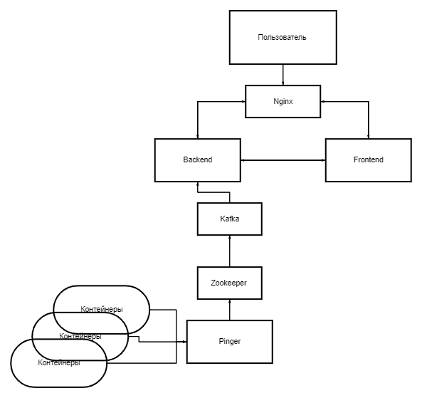

# Ping-Monitor

Ping-Monitor – это система мониторинга контейнеров, которая периодически (5 сек) выполняет пинг указанных IP-адресов (например, контейнеров) и отображает их состояние в режиме реального времени. Система состоит из нескольких сервисов:

- **pinger** – сервис на Go, который пингует заданные IP-адреса и отправляет результаты (время пинга, дату последней успешной попытки) в Kafka.
- **backend** – REST API-сервис на Go (с использованием Gin), который забирает сообщения из Kafka, сохраняет данные в PostgreSQL и предоставляет их через HTTP-эндпоинт `/stats`.
- **frontend** – клиентское приложение на Vue с TypeScript, которое получает данные через API backend и отображает их в виде таблицы.
- **nginx** – обратный прокси-сервер, который распределяет запросы:  
  - `/api/` → backend (порт 8080)  
  - Остальные запросы → frontend (статические файлы)
- **PostgreSQL** – база данных для хранения результатов пинга.
- **Kafka** – брокер сообщений, используемый для обмена данными между pinger и backend.
- **Zookeeper** – координационный сервис для Kafka.

Также в проекте реализован механизм ожидания (wait/retry) в сервисах backend и pinger, чтобы они не стартовали до готовности зависимых сервисов (PostgreSQL, Kafka).

## Общая схема сервисов



## Установка и запуск

1. **Клонируйте репозиторий:**

   ```bash
   git clone
   cd ping-monitor
   ```
2. **Проверьте и при необходимости отредактируйте конфигурационные файлы:**
    *backend/config.yaml* – настройки сервера (порт), подключения к PostgreSQL и Kafka.
  *pinger/config.yaml* – настройки пингера (интервал, целевые IP) и Kafka.

3. **Соберите и запустите все сервисы с помощью Docker Compose:**
  ```bash
    docker-compose build --no-cache
    docker-compose up
  ```
  Команда запустит следующие сервисы:

    postgres (PostgreSQL)
    zookeeper (для Kafka)
    kafka (брокер сообщений)
    backend (REST API)
    pinger (пингующий сервис)
    frontend (фронтенд-приложение)
    nginx (reverse proxy)

4. **Доступ к приложению:**
    
    nginx (reverse proxy):

      Откройте в браузере http://localhost.

      Запросы к /api/ будут проксироваться на backend (например, http://localhost/api/stats – возвращает JSON с данными).

      Остальные запросы будут отданы frontend (статические файлы, собранные с помощью Vite/Nginx).